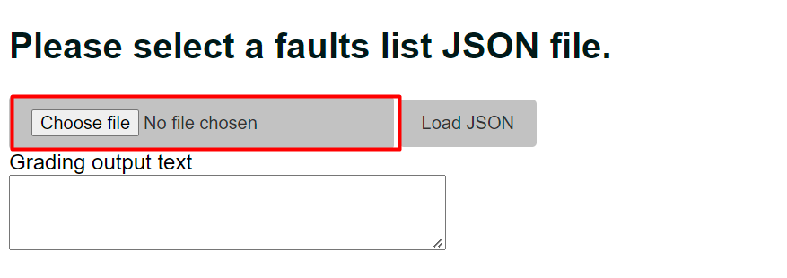
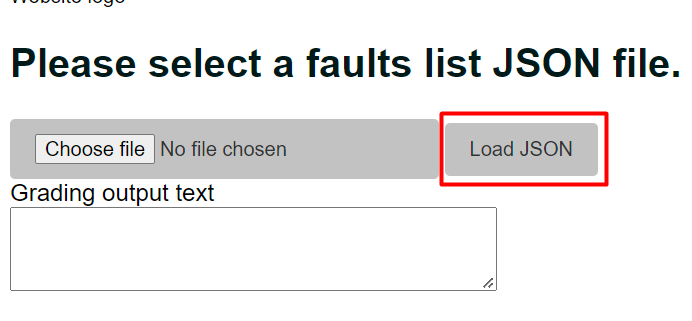
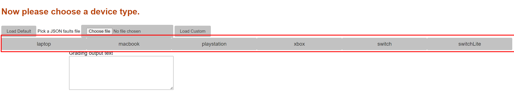

# Consoles and Laptops Faults Generator
This project is intended to serve as a useful tool which aims to automate the process of detailing faults which are found on various electronics devices, in order to send these faults and explanations to customers.

[Faults Generator Live Link](https://fwiffoplays.github.io/consoles-and-laptops-faults-generator/)

## Features
* File picker

* Device buttons

* Fault checkboxes

* Faults textbox

* 404 Page

* Favicon

* Footer

* Main page

Most of the site is contained within a single page. It begins with minimal content, but as the user interacts with the site and chooses relevent options, more content is added relating to their input. 
(For example: outputting the list of selected faults)

- File picker input
    - Initially the user will choose a JSON file to load in which contains the fault data. Allowing the user to load their own file will allow for quick and relatively simple modifications to the faults list as needed. 

- Load JSON button
    - This button will run the 'loadJson' function, which will read in the selected JSON file and parse it into an object called 'faultsJson' so that it can be easily interpreted by the rest of the program.

- Device selection buttons
    -

## Wireframes

## Technologies

- HTML

- CSS

- JavaScript

- Gitpod

- Visual Code Studio

- Github

- Git
    - The version control system which was used during the project's development

## Testing

### Responsiveness

### Accessibility

**Validator Testing**
- HTML
- CSS
- JavaScript

**Lighthouse Report**

**Github Footer link**
The link in the footer was tested by clicking it. Because it is a link to an external page it should open in a new tab.
It was verified that the link both opens in a new tab and navigates to the correct page (The github repository for the project).

**Inputs**
All inputs on the page were tested with various possible inputs, these include:

- File picker
Each test was carried out by choosing an input (including none at all) and clicking the 'Load JSON' button/
    - Tested with a JSON in the correct format, such as the one provided in the repository root. The program functioned as expected with no errors

    - Tested with no file selected. The program correctly prompts the user with an alert asking them to choose a file.

## Deployment
**Live Site**
The live version of this project was deployed on Github Pages, which is done through the following steps:
- Navigate to the project's github repository whilst logged into Github on the account which owns it
- Open the 'settings' tab
- Select the 'Pages' section
- Select the branch to deploy (Usually 'main' is appropriate)
- After waiting for about a minute for deployment to finish, navigate to the URL which is given near the top of the 'Pages' section.

**Version Control**

**Clone repository**

## Credits
    
- [w3schools.com](https://www.w3schools.com/js/js_json_intro.asp) for a variety of explanations on syntax as well as code samples for working with JSON files in JavaScript
