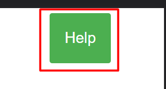

# Consoles and Laptops Faults Generator
This project is intended to serve as a useful tool which aims to automate the process of detailing faults which are found on various electronics devices, in order to send these faults and explanations to customers.

[Faults Generator Live Link](https://fwiffoplays.github.io/consoles-and-laptops-faults-generator/)

## Features

* Help prompt
  * Provided a prompt to the user for what action to perform next, as well as varying colour to indicate status.
  * This is an intuitive way of guiding the user through the program without being too invasive.

* Help modal + button
  * Opens up a modal which lists instructions for use of the app to the user.
  * This offers an alternative form of relaying to the user how to use the app if they prefer reading a sequence of steps.

* Load default button
  * Allows the user to load the default faults JSON file which is stored on the HTTP server
  * This is more convenient than choosing a faults file everytime the app is used, however would need to be updated with new faults by the server admin.

* File picker
  * Allows the user to choose a custom faults JSON file to be used, allowing for the user to make local changes to the faults they have available if needed.
  * These edits could be forwarded to the server admin once verified through use so they can be loaded more quickly with the 'Load Default' button.

* Device buttons
  * Displays the device types which were found in the faults JSON and allows the user to choose which one they want to generate faults for.

* Fault checkboxes
  * Allows the user to select which faults were found on the device.
  * This is an intuitive way for the user to quickly select multiple options from a list.

* Faults output text
  * Outputs the resulting faults information, with the descriptions placed into a textbox and the suggested grades in two seperate lines of text.
  * Allows the user to quickly 'select all' for easy copy and pasting using the shortcuts 'Ctrl + A' and 'Ctrl + C', improving efficiency.

* 404 Page
  * Alerts the user if they have navigated to an invalid page within the site and offers a hyperlink to return to the index page.
  * Improved the user friendliness of the site by allowing the user to return to the main page without the use of browser buttons.

* Favicon
  * Provides a small pencil icon for the browser to display within the site's tab
  * This makes the page more easily identifiable when the user has many tabs open

**Potential future features**
* Add sub-faults to insert into a general fault such as 'Controller fault'
* An interface for editing the JSON in a more user-friendly manner.

## Wireframes

## Technologies

* HTML
  * Tells the browser what content to put on the web page. This is edited by the JavaScript as the user interacts with the program to add new information or options to the screen.

* CSS
  * Tells the browser how to style the content on the web page, such as color, size and orientation.

* JavaScript
  * A client-side interpreted language which adds interactivity to the site. This was used to implement most of the site's functionality such as loading the JSON file, adding interactivity to the buttons and outputting the result.

* Gitpod
  * A cloud-based service which allowed the project to be developed on any device with a modern web browser and an internet connection by running a docker container with the required modules for development on a remote server.

* Visual Code Studio

* Github

* Git
  * The version control system which was used during the project's development

## Testing

### Responsiveness

### Accessibility

**Validator Testing**
- HTML
- CSS
- JavaScript

**Lighthouse Report**

**Github Footer link**
The link in the footer was tested by clicking it. Because it is a link to an external page it should open in a new tab.
It was verified that the link both opens in a new tab and navigates to the correct page (The github repository for the project).

**Inputs**
All inputs on the page were tested with various possible inputs, these include:

- File picker
Each test was carried out by choosing an input (including none at all) and clicking the 'Load JSON' button/
    - Tested with a JSON in the correct format, such as the one provided in the repository root. The program functioned as expected with no errors

    - Tested with no file selected. The program correctly prompts the user with an alert asking them to choose a file.

## Deployment
**Live Site**
The live version of this project was deployed on Github Pages, which is done through the following steps:
- Navigate to the project's github repository whilst logged into Github on the account which owns it
- Open the 'settings' tab
- Select the 'Pages' section
- Select the branch to deploy (Usually 'main' is appropriate)
- After waiting for about a minute for deployment to finish, navigate to the URL which is given near the top of the 'Pages' section.

**Version Control**

**Clone repository**

## Credits
    
- [w3schools.com](https://www.w3schools.com/js/js_json_intro.asp) for a variety of explanations on syntax as well as code samples for working with JSON files in JavaScript
