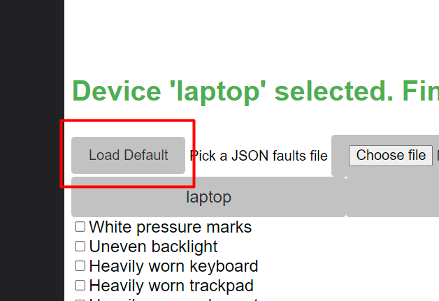
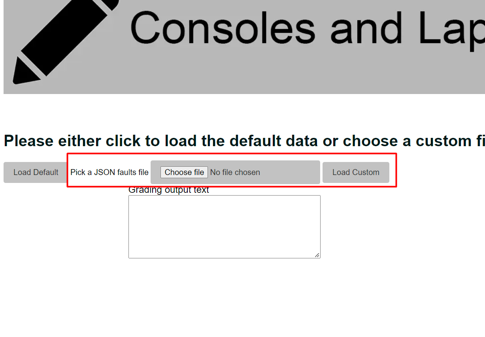
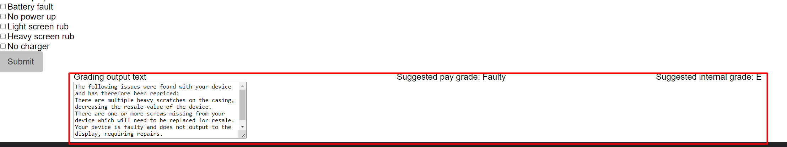
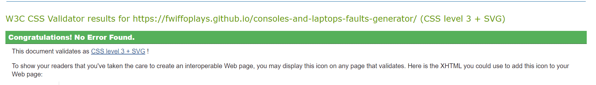

# Consoles and Laptops Faults Generator
This project is intended to serve as a useful tool which aims to automate the process of detailing faults which are found on various electronics devices, in order to send these faults and explanations to customers.


[Faults Generator Live Link](https://fwiffoplays.github.io/consoles-and-laptops-faults-generator/)

## Features

* Help prompt
  * Provided a prompt to the user for what action to perform next, as well as varying colour to indicate status.
  * This is an intuitive way of guiding the user through the program without being too invasive.


* Help modal + button
  * Opens up a modal which lists instructions for use of the app to the user.
  * This offers an alternative form of relaying to the user how to use the app if they prefer reading a sequence of steps.


* Load default button
  * Allows the user to load the default faults JSON file which is stored on the HTTP server
  * This is more convenient than choosing a faults file everytime the app is used, however would need to be updated with new faults by the server admin.



* File picker
  * Allows the user to choose a custom faults JSON file to be used, allowing for the user to make local changes to the faults they have available if needed.
  * These edits could be forwarded to the server admin once verified through use so they can be loaded more quickly with the 'Load Default' button.



* Device buttons
  * Displays the device types which were found in the faults JSON and allows the user to choose which one they want to generate faults for.


* Fault checkboxes
  * Allows the user to select which faults were found on the device.
  * This is an intuitive way for the user to quickly select multiple options from a list.


* Faults output text
  * Outputs the resulting faults information, with the descriptions placed into a textbox and the suggested grades in two seperate lines of text.
  * Allows the user to quickly 'select all' for easy copy and pasting using the shortcuts 'Ctrl + A' and 'Ctrl + C', improving efficiency.



* 404 Page
  * Alerts the user if they have navigated to an invalid page within the site and offers a hyperlink to return to the index page.
  * Improved the user friendliness of the site by allowing the user to return to the main page without the use of browser buttons.


* Favicon
  * Provides a small pencil icon for the browser to display within the site's tab
  * This makes the page more easily identifiable when the user has many tabs open


**Potential future features**
* Add sub-faults to insert into a general fault such as 'Controller fault'
* An interface for editing the JSON in a more user-friendly manner.


## Technologies

* HTML
  * Tells the browser what content to put on the web page. This is edited by the JavaScript as the user interacts with the program to add new information or options to the screen.

* CSS
  * Tells the browser how to style the content on the web page, such as color, size and orientation.

* JavaScript
  * A client-side interpreted language which adds interactivity to the site. This was used to implement most of the site's functionality such as loading the JSON file, adding interactivity to the buttons and outputting the result.

* Gitpod
  * A cloud-based service which allowed the project to be developed on any device with a modern web browser and an internet connection by running a docker container with the required modules for development on a remote server.

* Visual Code Studio
  * An IDE which was used to develop the project. The web-based version was used, along with the docker container hosted by Gitpod which contained the modules required for the project, such as a web server for testing.

* Github
  * The cloud-based hosting service which allows for managing Git repositories as well as hosting the live version of the web site.

* Git
  * The version control system which was used during the project's development, allowing for incremental changes to the project as well as documentation of its development through commit messages and this readme file.

## Testing

### Responsiveness

The responsiveness of the site was tested by using the Google Chrome developer tools to emulate a phone-sized screen.

Steps taken to test:
1. Navigate to the live site within the browser
2. Press F12 to open developer tools
3. Press Ctrl + Shift + M to access the device toolbar
4. At the top under 'dimensions' choose 'iPhone SE'

The iPhone SE has a small, lower resolution screen so is a good test for how the site responds on a small device. Using a mixture of media queries and CSS elements the site has been made to rearrange itself and be legible even on a smaller screen, however scrolling may be required to use the site on a small device.


### Accessibility

For accessibility testing the [WAVE accessibility tool](https://wave.webaim.org/) was used.
In my report I received one error and one warning, however the error is a false positive regarding poor contrast. I verified visually that the text within the button is clearly legible.


**Validator Testing**
* HTML
  * The site's HTML content was verified using the [w3 validator](https://validator.w3.org/) which returned two errors for the main page:
  * A 'p' element was found within the 'ol' element for the help modal, which is not allowed in this context. This was resolved by moving the 'p' just after the list.
  * An 'h2' tag was found where there should have been an 'h1' closing tag, which was resolved by changing it to an 'h1' closing tag.


  * The 404 page gave two errors:
  * The website banner did not have an alt attribute which was corrected by copying the one used within the main page.
  * The same 'h2' tag was found at the end of a header where an 'h1' tag was expected. This was again resolved by replacing the tag with an 'h1' closing tag.


* CSS
  * The site's CSS content was verified with the [w3 jigsaw validator](https://jigsaw.w3.org/css-validator/) which found one error:
  At line 83 of the CSS file there was a type where the letter 'f' was placed at the end of a line, producing an invalid value. This was corrected by removing the character.




  * JavaScript
    * Finally, the site's JavaScript was validated with [JSHint](jshint.com) which returned no errors and one warning regarding declaring functions within loops, which is due to the way I created the event listeners for the device type buttons

  

**Lighthouse Report**

The lighthouse testing which is built into Google Chrome was used to verify metrics such as the site's performance and accessibility.
A very high score was achieved because of considerations such as there being only one image on the page (The main banner) which was compressed using the .webp format for much better network performance.


**Inputs**

All inputs on the page were tested with various possible inputs, these include:

**File picker**

Each test was carried out by choosing an input (including none at all) and clicking the 'Load JSON' button/

| Input                      | Expected Result                         | Pass/Fail? | Comment                                                                                                                         |
|----------------------------|-----------------------------------------|------------|---------------------------------------------------------------------------------------------------------------------------------|
| Valid JSON                 | Device type buttons are listed          | Pass       |                                                                                                                                 |
| No file selected           | Prompt user to select a JSON file       | Pass       |                                                                                                                                 |
| Invalid JSON file selected | Prompt user to select a valid JSON file | Fail       | Error in console due to invalid JSON. Further validation could be implemented to catch the error and output to user on the page |

**Device type buttons**

Each device type button which is generated was tested to ensure that the program correctly displays faults for each type:

| Input       | Expected result                          | Pass/Fail? | Comment |
|-------------|------------------------------------------|------------|---------|
| laptop      | Laptop faults checkboxes are listed      | Pass       |         |
| macbook     | Macbook faults checkboxes are listed     | Pass       |         |
| playstation | Playstation faults checkboxes are listed | Pass       |         |
| xbox        | Xbox faults checkboxes are listed        | Pass       |         |
| switch      | Switch faults checkboxes are listed      | Pass       |         |
| switchLite  | Switch lite faults checkboxes are listed | Pass       |         |

**Fault checkboxes**

The faults checkboxes were tested by clicking different variations of faults and then clicking 'Submit'

| Input                   | Expected result                                                                                                | Pass/Fail? | Comment                                                   |
|-------------------------|----------------------------------------------------------------------------------------------------------------|------------|-----------------------------------------------------------|
| Several faults selected | Each fault's description is added to the output text box and the lowest pay grade and internal grade are shown | Pass       |                                                           |
| No faults selected      | No faults are displayed in the output boxes                                                                    | Pass       | Could be improved by prompting the user to select a fault |


## Deployment

**Live Site**

The live version of this project was deployed on Github Pages, which is done through the following steps:
- Navigate to the project's github repository whilst logged into Github on the account which owns it
- Open the 'settings' tab
- Select the 'Pages' section
- Select the branch to deploy (Usually 'main' is appropriate)
- After waiting for about a minute for deployment to finish, navigate to the URL which is given near the top of the 'Pages' section.

**Version Control**

Throughout the sites development, the version control system 'Git' was used to upload an document changes made to the project.
The following commands were written into the command line to perform this for each change:

```git add <file>```  -Tells git which file(s) should be added to the next commit

```git commit -m "Commit message"```  -Creates a commit with the added files and sets the commit log message.

```git push```  -Sends the commit to the Git server for backup

**Clone repository**

In order to clone the repository within your git-enabled IDE (Such as visual studio code), the following steps can be taken:

- Open the project's GitHub repository in your browser
- Select the 'code' drop down
- Click the 'HTTPS' button
- Copy the repository link provided to the clipboard
- Within your IDE's terminal, type ```git clone <copied repo url>```

## Credits
    
- [w3schools.com](https://www.w3schools.com/js/js_json_intro.asp) for a variety of explanations on syntax as well as code samples for working with JSON files in JavaScript
- Pencil icon for favicon and banner from [flaticon.com](https://www.flaticon.com/free-icon/pencil_650194?related_id=650143&origin=search)